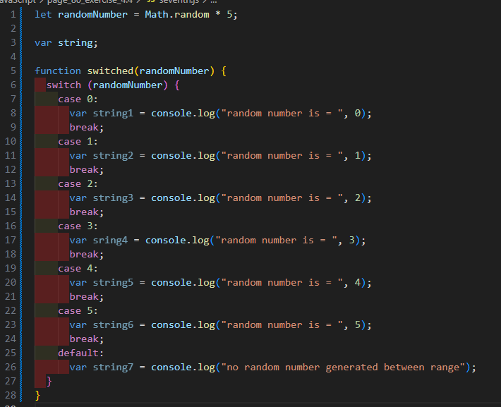
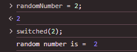
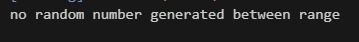

# Page 80 exercise 4.4

## screenshots

## -I am not familiar with the prompt function yet so i added an html file.

## -I then used my console to input the values

## - I put most of my switch statements in a function so I could easily call them in the console.
